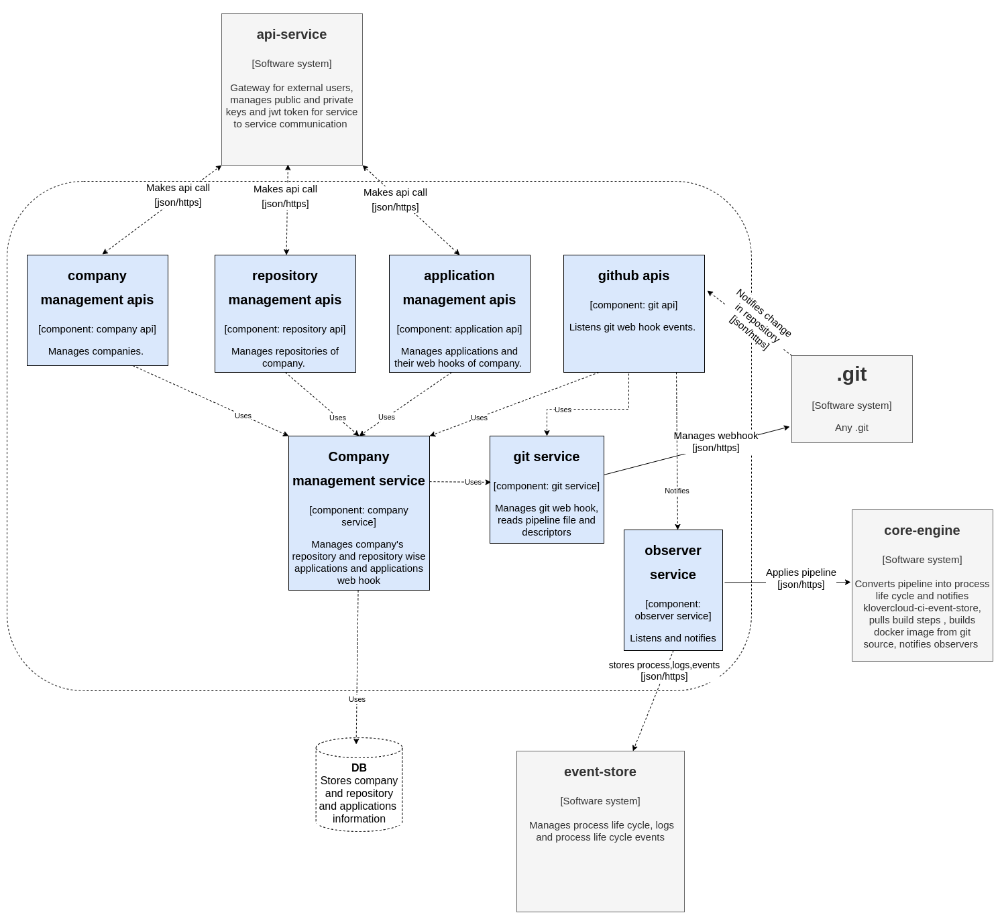

# Context Diagram

# Container Diagram

# Component Diagram: integration-manager

# Component Diagram: core-engine

# Component Diagram: event-store

# Component Diagram: agent

# Component Diagram: lighthouse-query

# Component Diagram: lighthouse-command

